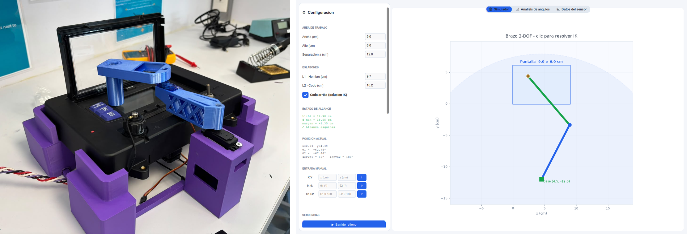
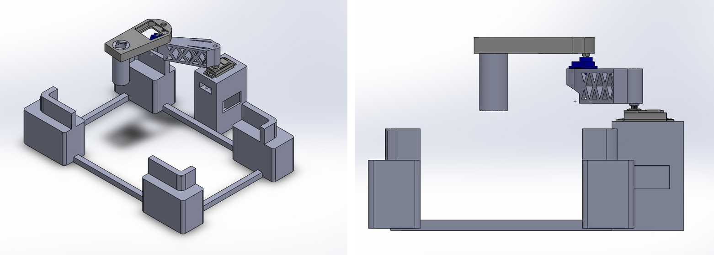
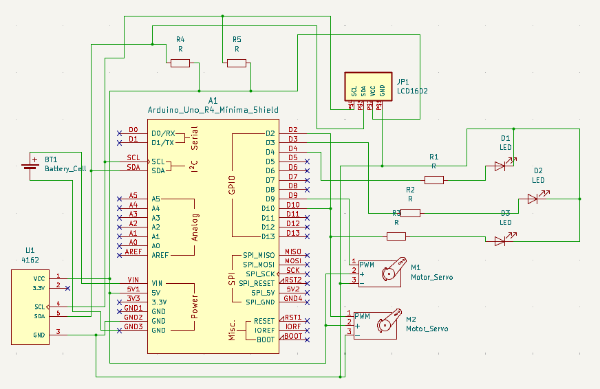
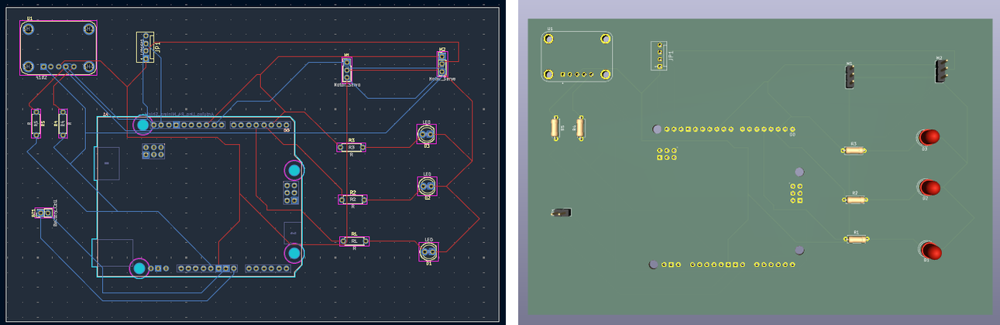
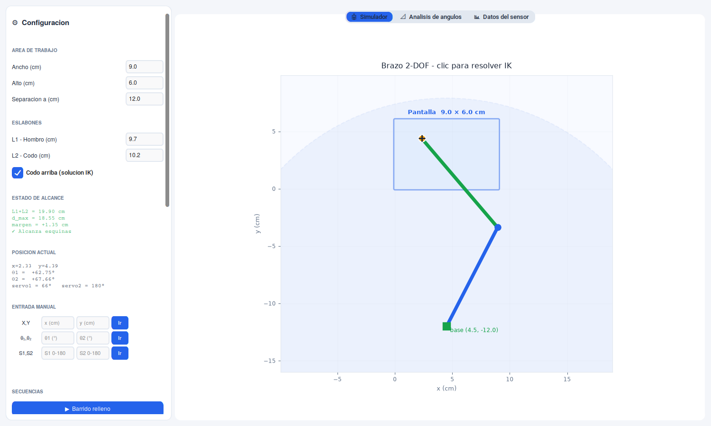
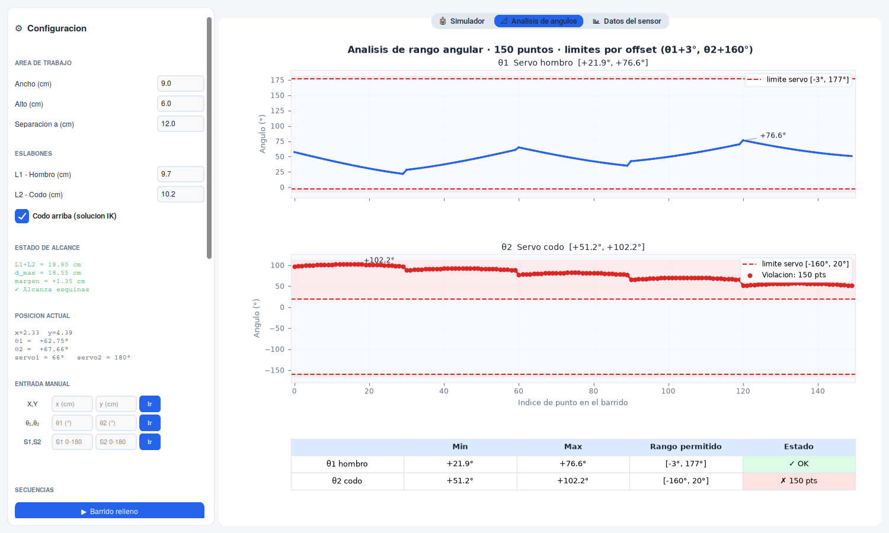
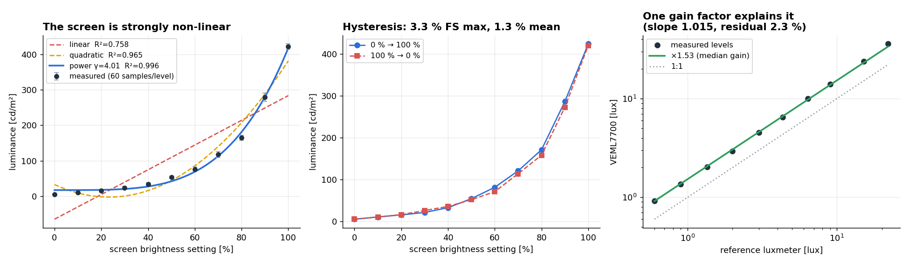
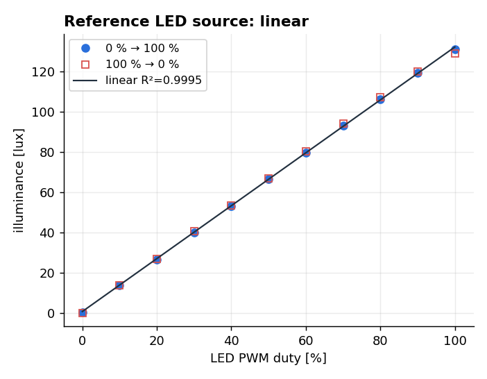

# Screen Luminance Meter with a 2-DOF Robotic Arm

**A portable instrument that measures how bright a digital display actually is.** A 2-DOF arm carries a VEML7700 light sensor to any point on a screen, a Python desktop app solves the inverse kinematics and drives it over USB or WiFi, and the readings are converted from illuminance to luminance and checked against a reference luxmeter.



> Course challenge for **Carrier**, *Experimental characterization through electronic instrumentation* (Tec de Monterrey, Grupo 301, June 2026). Carrier needed an objective way to check the luminance of Transicold APX display modules under varying ambient light. **My contribution was integral across the system:** I designed the PCB and the 3D-printed structure (the cradle that holds the display unit and the arm links in the photo above), and co-developed the screen-to-arm coordinate transformation, the kinematics and the control code with the software lead. Full report (Spanish) in [`docs/`](docs).
>
> The characterization section below is a **re-analysis of the raw captures**, run from the data in [`data/`](data) by [`analysis/metrology.py`](analysis/metrology.py). It reaches some conclusions the original report did not, and disagrees with it in one place — both are noted.

## The problem

A display is legible or not depending on its **luminance** — the light it sends towards the eye, in cd/m² — but a cheap ambient-light sensor measures **illuminance**, the light arriving at the sensor, in lux. The two are related through the solid angle Ω that the source subtends at the detector:

```math
E \approx L\,\Omega \quad \Longrightarrow \quad L \approx \frac{E}{\Omega}
```

with, for a circular aperture of radius $a$ seen from a distance $d$ on its axis,

```math
\Omega = 2\pi\left(1 - \frac{d}{\sqrt{d^2+a^2}}\right) \quad\xrightarrow{a \ll d}\quad \frac{\pi a^2}{d^2}
```

So the instrument has to do three things: put the sensor at a **known, repeatable** point in front of the screen, read illuminance there, and convert. The repeatability is what the arm buys — a hand-held sensor changes distance and angle between readings, and both feed straight into Ω.

## The machine

| Component | Role |
|---|---|
| Arduino UNO R4 WiFi | Controller, serial/TCP command parser |
| VEML7700 (I²C) | Ambient light sensor, illuminance in lux |
| LCD 16×2 (I²C) | Local readout, shares the bus with the sensor |
| LEDs red / yellow / green | In-range indicator against a lux threshold |
| MG995 + SG90 servos | Shoulder and elbow, pins D9 / D10 |
| 9 V battery + 4×AA (6 V) | Separate rails for logic and servos |
| 1000 µF + 10 kΩ ×2 | Servo current-spike buffer, I²C pull-ups |
| PLA structure | Cradle, servo mounts, links, housing |

Two electrical decisions carried the build. **The servos get their own battery**, because their inrush current on the shared 5 V rail was resetting the board and corrupting the LCD. And **the WiFi radio was cut from the final firmware** for the same reason: the ESP32's transmit spike browned out the rail. The app still speaks TCP — the transport layer is abstract — but the delivered build runs over USB serial at 9600 baud.

### The structure



Everything mechanical was designed in CAD and printed in PLA: a cradle that clamps the display unit so the screen sits at a fixed, known position relative to the arm base, the servo towers, the two links and the electronics housing. The cradle is what makes the measurement repeatable — the kinematics assume the screen origin is exactly 12 cm from the shoulder, and that only holds if the display cannot shift between sessions. The side view was used to verify dimensions, ranges of motion and component placement before printing, and the second link is lattice-cut to save mass at the end of the arm, where the smaller SG90 carries the load. Printing let the geometry iterate quickly.

### The electronics



The PCB is a two-layer shield that sits on the UNO R4: one layer is mostly the common ground plane, the other carries power and signals, with the I²C pull-ups on board. It was routed but **not manufactured** within the course deadline, so the prototype in the photo still runs on protoboard — the board is the proposed replacement for that wiring.



## The software



The app ([`app/brazo_ctk_v3.py`](app/brazo_ctk_v3.py), customtkinter + matplotlib) is the whole operator interface:

**Kinematics.** Screen coordinates (u, v) map to arm coordinates, and the closed-form 2-link inverse kinematics returns the joint angles, with the elbow-up/elbow-down branch selectable:

```math
\cos\theta_2 = \frac{r^2 - L_1^2 - L_2^2}{2L_1L_2}, \qquad
\theta_1 = \mathrm{atan2}(y,x) - \mathrm{atan2}\!\left(L_2\sin\theta_2,\; L_1 + L_2\cos\theta_2\right)
```

Joint angles become servo commands through a calibration offset, `s₁ = θ₁ + 3°` and `s₂ = θ₂ + 160°`, clipped to the 0–180° the servos accept.

**Reach checking before you move anything.** With L₁ = 9.7 cm, L₂ = 10.2 cm and the base 12 cm below the screen plane, reach is 19.90 cm and the furthest corner of a 9 × 6 cm screen sits at 18.55 cm — a 1.35 cm margin, which the app reports live as geometry is edited. Unreachable points are pulled towards the screen centre instead of being sent as a silently clipped command.



The second tab sweeps the planned path and plots both joint angles against the servos' permitted range, so a sequence that would drive a servo past its limit is visible before it runs. In the screenshot above the elbow offset is deliberately left at a value that flags all 150 points — that is the check doing its job.

**Transport.** `BaseTransport` has two implementations, `SerialTransport` (pyserial) and `TcpTransport` (socket, for the WiFi build), so everything above them is transport-agnostic. The wire protocol is four text commands: `s1:<deg>,s2:<deg>`, `SCAN:<n>` → `SCAN_RESULT:<lux_avg>,<white_avg>`, `THRESH:<low>,<high>`, `PING` → `PONG`.

**Sequences.** A raster fill (6 × 35 points), a border trace, and a corners-plus-centre routine that stops at each of the five points, averages *n* samples, and logs them. Results are plotted per point, mapped spatially, exported to CSV and optionally pushed to ThingSpeak.

## Characterization

Two sources were measured over a 0 → 100 → 0 % brightness sweep, with the sensor fixed: a **computer screen** (the device under test) and a **blue LED** driven by PWM (a source known to be near-linear, used as a control). A calibrated luxmeter measured the same sweeps as the reference.



**1. The screen is strongly non-linear, but the exponent is not pinned down.** A straight line explains only R² = 0.758 of the response; a power law $L = L_0 + k B^{\gamma}$ reaches 0.996. The exponent, though, depends entirely on how the offset is handled:

| Estimate | γ | R² |
|---|---|---|
| Power law, L₀ free | **4.01 ± 0.21** | 0.996 |
| Power law, L₀ fixed at the measured 0 % level | 3.66 ± 0.19 | 0.992 |
| Log-log linearization (the route used in the report) | 1.87 | — |
| Quoted in the report, §7.1 / §7.2 | 2.21 / 3.17 | 0.99 |

All of these describe the same eleven points. Over a single decade of brightness, with L₀ and k both free, γ is simply not identifiable to better than "somewhere between 2 and 4" — the honest statement is that the response is **strongly convex**, not that it has a specific exponent. Pinning γ down would need more levels at the dark end and an independently measured black level.

**2. The sensor's error is a gain error, not a shape error.** This is the result that was not in the original report. Plotting the VEML7700 against the reference luxmeter over the same sweep, the log-log slope is **1.015** — indistinguishable from 1, meaning the sensor tracks the reference proportionally — with a constant factor of **1.53** and only 2.7 % spread across ten brightness levels. Divide by that single number and the sensor agrees with the reference to a **mean 2.3 %, worst case 6.2 %**. In other words the sensor's headline ~50 % error is one calibration constant away from being a 2 % instrument; it does not need a non-linear correction.

**3. Hysteresis and repeatability.** Up and down sweeps separate by at most 3.3 % of full scale (1.3 % on average) on the screen, and 1.5 % on the LED. Repeatability across the levels above the noise floor is 7.3 % CV on the screen — the screen itself drifts — against 0.5 % on the LED.



**4. The raw capture has three bad samples, and they matter.** Three readings out of 660 report 346,033.875 lux — the library's overflow value — while their raw ALS counts are 9, 46 and 73, i.e. perfectly ordinary. Each is the *first* sample of a burst. Left in, they move the mean of the 40 % level from 2.8 lux to 5,770 lux. They are listed in [`results/discarded_samples.csv`](results) and excluded from everything above. Anyone re-running the original script on the published capture without filtering them will get different numbers than the report's.

## Honest limitations

- **Ω is inconsistent across the repo, and every cd/m² depends on it.** The app converts with Ω = 0.170 sr, the metrology script with 0.0849 sr — exactly a factor of two apart — and two of the three archived scan sessions were exported with Ω ≈ 0.471 sr. So the luminance columns are not comparable between sessions and the absolute cd/m² scale is uncertain by a factor of a few. The illuminance (lux) column is the measurement; the conversion is arithmetic and should be re-derived from a measured aperture radius and working distance.
- **No absolute luminance standard.** The reference is a luxmeter, which measures the same quantity as the sensor. Neither instrument was traceably calibrated against a luminance standard, so the cross-check above validates agreement, not accuracy.
- **Hysteresis is measured on the source, not the instrument.** A screen takes time to settle after a brightness change; part of the 3.3 % is the panel, not the sensor.
- **The PCB was never manufactured**, so the routing has not been validated electrically.
- **The arm is planar.** It positions the sensor in x–y at a fixed standoff; tilt of the sensor relative to the screen normal is set by the mount, not controlled, and it enters the measurement through cos θ.

## Repository

```
app/brazo_ctk_v3.py          desktop app: kinematics, transports, sequences, plots
firmware/brazo_serial_usb/   UNO R4 firmware for the delivered (USB) build
firmware/veml7700_*/         sensor bring-up and characterization sketches
analysis/metrology.py        re-analysis: cleaning, model fits, cross-calibration, figures
analysis/analisis_metrologia.py   original course analysis script
analysis/capture.py          serial logger used to record the sweeps
data/screen_sweep_veml7700.csv    raw burst capture, 660 samples, 0 -> 100 -> 0 %
data/reference_luxmeter_*.csv     the same sweeps measured with the reference luxmeter
data/scan_sesion_*.csv            arm scan sessions exported by the app
results/                     model fits, cross-calibration, metrology parameters (CSV)
docs/                        final report (Spanish), figures
```

```bash
pip install numpy pandas scipy matplotlib
python analysis/metrology.py          # reproduces every number and figure above

pip install customtkinter matplotlib numpy pyserial
python app/brazo_ctk_v3.py            # the app runs without hardware (simulator tab)
```

## Stack

Python · NumPy · pandas · SciPy · Matplotlib · customtkinter · pyserial · Arduino (C++) · KiCad · 3D printing (PLA)

## Team

José Feliciano Gutiérrez Rubio (software lead) · José Alfredo Almaguer Cruz (circuit design) · **Héctor Campbell Salas (PCB, 3D-printed structure, coordinate transformation, kinematics and control code)** · Bernardo Lugo Albor (experimental characterization)
